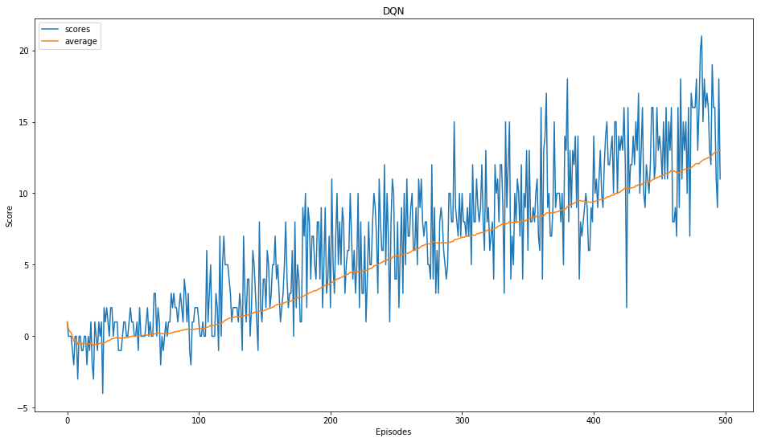

# Project 1: Navigation

## Q-Function

The Q-function calculates the expected reward R for all possible actions A in all possible states S. The challenge with the Q-function above is choosing an action to take while the agent is still learning. Should the agent choose an action based on the Q-values observed thus far or choose randomly.

## Epsilon Greedy Algorithm

The exploration vs. exploitation dilemma is solved with a epsilon greedy algorithm. This allows the agent to explore some of the time and choose the best path others. As it trains it explores, chooses a random action, less and slowly starts to choose the path it has determined to be the best. So we use a starting value, a decay factor and a final value. After every episode we 'decay' or reduce the starting value lower to a minimum so there is always a little exploring to do.

e = max(e*decay, min)

## Deep Q-Network (DQN)

A deep neural network is used to estimate the Q-function. Given a network F, finding an optimal policy is finding the best weights w such that F(s,a,w) ≈ Q(s,a). The network used for this is rather simple with an input, 2 hidden layers and the actions as output.

## Experience Replay

Experience replay allows the RL agent to learn from past experience as each state, action, reward, and next state (s, a, r, s') ar saved in memory. Then samples are drawn from this buffer as part of the training. The samples are randomly selected so that the data is uncorrelated. This create a smooth learning experience, and also provides the ability to reuse the data. Perhaps similiar to us dreaming.

## Hyperparameters

I choose to use the simple [Deep Q-Network](https://storage.googleapis.com/deepmind-media/dqn/DQNNaturePaper.pdf) with Experience Replay to solve this challenge in ~500 Episodes.  Below are some variables you can change to see how training is affected. In my code you'll find what I used.

1. Agent
    - state_size: Input size
    - action_size: Output size
    - BUFFER_SIZE: Replay buffer size
    - BATCH_SIZE: Minibatch size
    - GAMMA: Discount factor for expected rewards
    - TAU: Multiplicative factor for updating the target network weights
    - LR: Learning rate
    - UPDATE_EVERY: How often to update the network

2. Training
    - max_episodes: Maximum number of training episodes
    - max_steps: Maximum number of timesteps per episode
    - eps_start: Starting value of epsilon, for epsilon-greedy action selection
    - eps_end: Minimum value of epsilon
    - eps_decay: Multiplicative factor (per episode) for decreasing epsilon

- Training for max_episodes: 1000 and max_steps: 500
- eps_start: 1.000	eps_end: 0.010	 eps_decay: 0.995

In my first attempt, I built a DQN with 2 fully-connected (FC) layers, 32 nodes each one. This model solved the environment but took 1000+ episodes. I ended up using 1 FC 128 and 1 FC with 64 units with Relu activations.

## Results

- Episode: 100	Average Score: 0.53	 Eps: 0.61
- Episode: 200	Average Score: 3.66	 Eps: 0.37
- Episode: 300	Average Score: 6.87	 Eps: 0.22
- Episode: 400	Average Score: 9.38	 Eps: 0.14
- Episode: 497	Average Score: 13.01	 Eps: 0.08
- Solved in 497 episodes!	Average Score: 13.01

## Future

Other option that could be implmented are below.
-  [Double Deep Q-Network](https://arxiv.org/abs/1509.06461)
-  [Dueling Q-Network](https://arxiv.org/abs/1511.06581)
-  [Prioritized Experience Replay](https://arxiv.org/abs/1511.05952)

## Config

I ended up using Udacity's built in workspace and training on CPU and only took a few minutes to train. No visual was used.